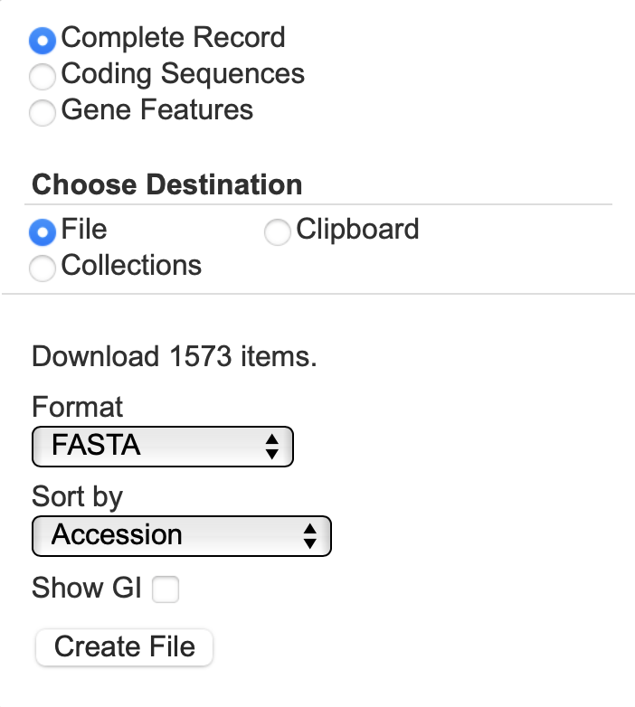

# **Rotate use case**
### Rotate and align 1,546 mitochondrial and 465 chloroplast assemblies
<br />

**********
## **1&nbsp;&nbsp;|&nbsp;&nbsp;Install rotate**
```
# download and compile rotate
git clone https://github.com/richarddurbin/rotate.git
cd rotate
make
cd ..

# make executable and add to $PATH
chmod +x rotate/rotate
export PATH=$PATH:${PWD}/rotate/
```

<br />

**********

## **2&nbsp;&nbsp;|&nbsp;&nbsp;Fetch sample datasets from NCBI**

Visit https://www.ncbi.nlm.nih.gov/nuccore

### Download 1,546 mitochondrial assemblies:
Search for:
```
(mitochondrion[filter] AND complete[All Fields] AND genome[All Fields]) AND "Mammalia"[Primary Organism] AND refseq[filter])
```
Click ```Send to``` and select ```Complete Record```, ```File```, Format: ```Fasta``` and Sort by ```Accession```:




Then click ```Create File``` and rename it:

```
mv ${DOWNLOAD_LOCATION}/sequence.fasta input/mammalia.fa
```
<br />

### Download 465 chloroplast assemblies:

Likewise, download all chloroplast genomes available, using the search string ```(chloroplast[filter] AND complete[All Fields] AND genome[All Fields]) AND "Rosaceae"[Primary Organism] AND refseq[filter])``` and save them as ```input/rosaceae.fa```.

<br />

**********

## **3&nbsp;&nbsp;|&nbsp;&nbsp;Rotate & align**


### Install MAFFT 7 for alignment step:
-> follow the steps described at https://mafft.cbrc.jp/alignment/software/

### Rotate all mitochondria sequences to a shared anchor string, then align with mafft and rotate to a common mitochondrial starting position:

```
# rotate to custom anchor string*, allowinging for 1 mismatch
rotate -s TACGACCTCGATGTTGGATCA -m 4 input/mammalia.fa > output/mammalia.rotated.fa

# align with mafft
mafft output/mammalia.rotated.fa > output/mammalia.aligned.fa

# offset to common mitochondrial start position
rotate -x 23859 output/mammalia.aligned.fa > output/mammalia.final.fa
```
<sup> \* anchor sequence (TACGACCTCGATGTTGGATCA) selected using the 100 Vertebrate Cons track in the hg38 UCSC Genome Browser (https://genome.ucsc.edu)</sup>

### Likewise, rotate and align chloroplast assemblies to common starting position:

```
# rotate to custom anchor string*, allowinging for 1 mismatch
rotate -s CGAAATCGGTAGACGCTACG -m 1 input/rosaceae.fa > output/rosaceae.rotated.fa

# align with MAFFT
mafft output/rosaceae.rotated.fa > output/rosaceae.aligned.fa

# offset to conventional chloroplast start position
rotate -x 163249 output/rosaceae.aligned.fa > output/rosaceae.final.fa
```
<sup> \* anchor sequence (CGAAATCGGTAGACGCTACG) is a common barcode primer (see https://doi.org/10.1093/nar/gkl938)</sup>


